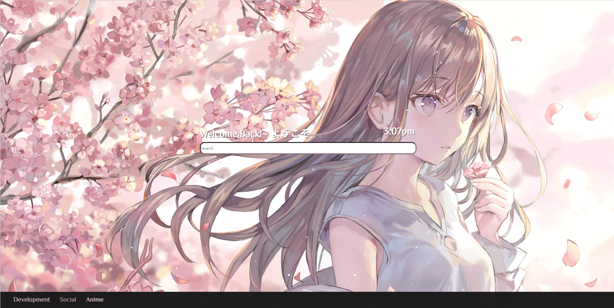

# KawaiiStart



Features
-------------------------------
  <ul>
    <li>Menu</li>
    <li>Clock</li>
    <li>Dynamic Backgrounds</li>
  </ul>
  
Use
-------------------------------
### Adding Menu Options

Open index.html and look for <br>
``` html
 <li id='category-1'> Development
   <ul id='sub-menu-1'>
     <li><a id='link-1' href='https://github.com'>Github</a></li>
     <li><a id='link-2' href='https://codepen.io'>Codepen</a></li>
     <li><a id='link-3' href='https://stackoverflow.com'>Stack Overflow</a></li>
   </ul>
 </li>
```
Create a new one or replace an existing one.
-Note: You will have to open up css/style.css and edit the padding 
        on whatever you want. Example:
``` css
#sub-menu-1 {
    margin-top: -178px;
}
```

###Background and Theme colors: 
<ol>
  <li>To add a new background image put it in the images folder underneath Wallpaper[lastnumber+1] and make it jpg</li>
  <li>Open up js/theme.js, and look for 
``` javascript
  var currentBackground = getRandomIntInclusive(1, 2);//How many wallpapers on the right
```
    change the right side number to include your new wallpaper.
  </li>
  <li>###Color Theme
``` javascript
var colors = [
    ['#9E9CB1','#7A7994','#C0BCCD','#2C3350', dark], //Wallpaper1
    ['#DABEC3','#C1A7B1','#F3D9D7','#866E76', dark]  //Wallpaper2
];```    
    Create a new sub array like so
``` javascript
    var colors = [
    ['#9E9CB1','#7A7994','#C0BCCD','#2C3350', dark], //Wallpaper1
    ['#DABEC3','#C1A7B1','#F3D9D7','#866E76', dark],  //Wallpaper2
    ['yourcolor','yourcolor','yourcolor','yourcolor', dark]  //Wallpaper3
];```    
  </li>
</ol>

###You're done, have fun.
